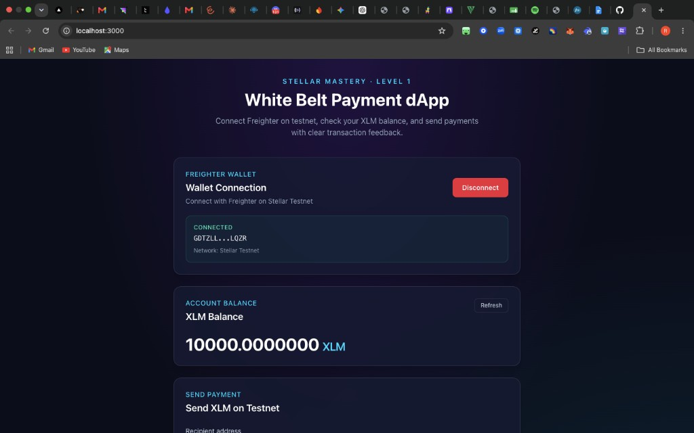
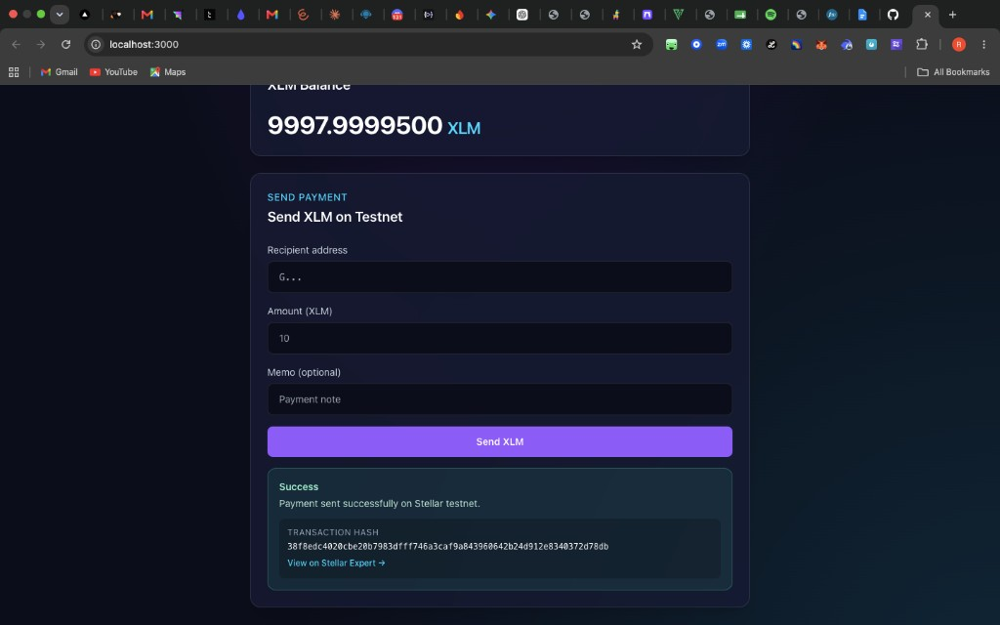
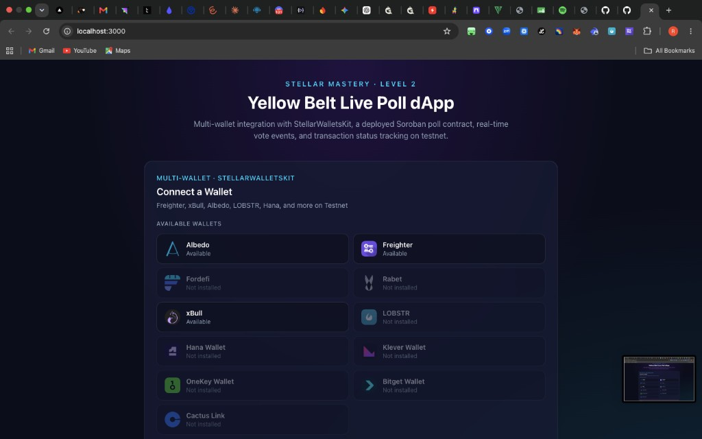
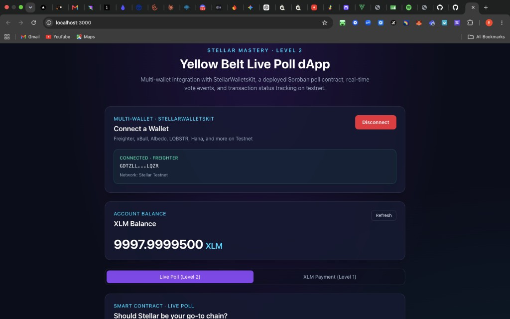
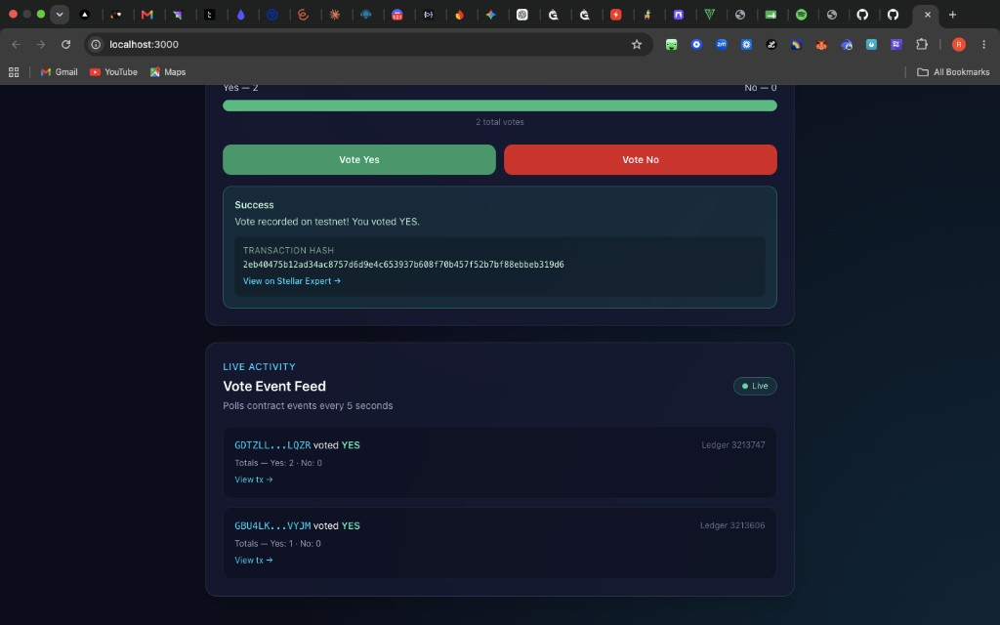
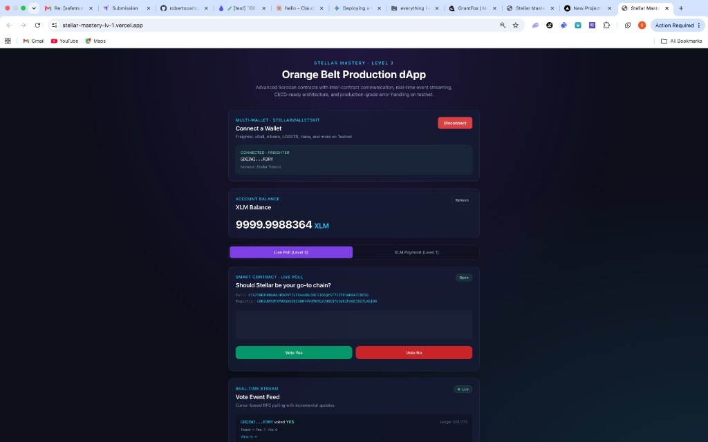
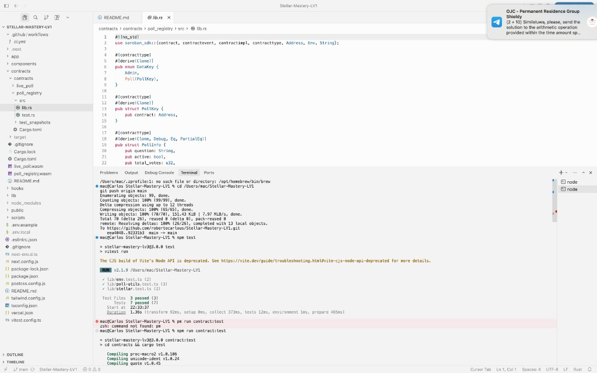
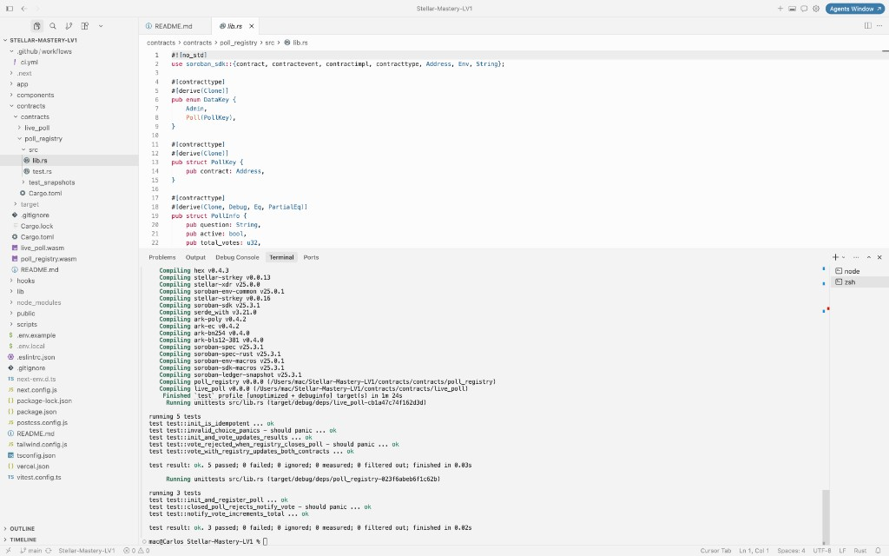
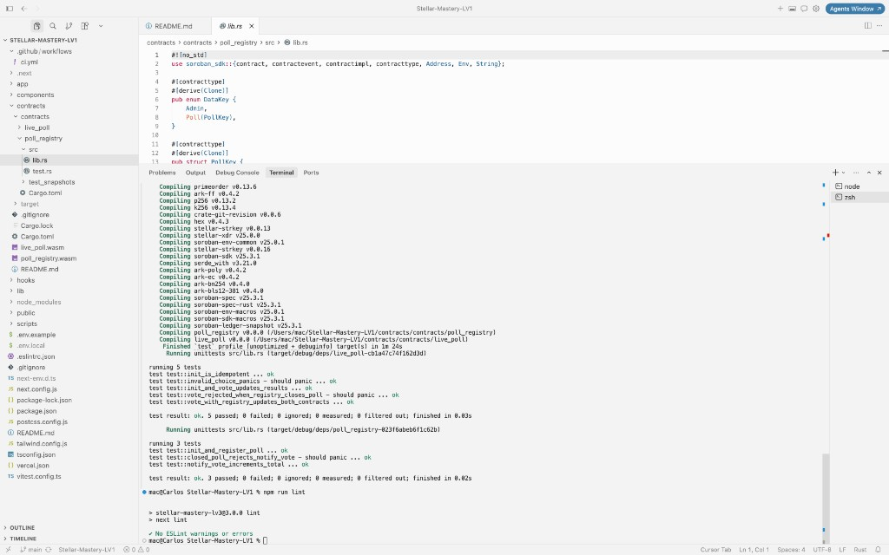
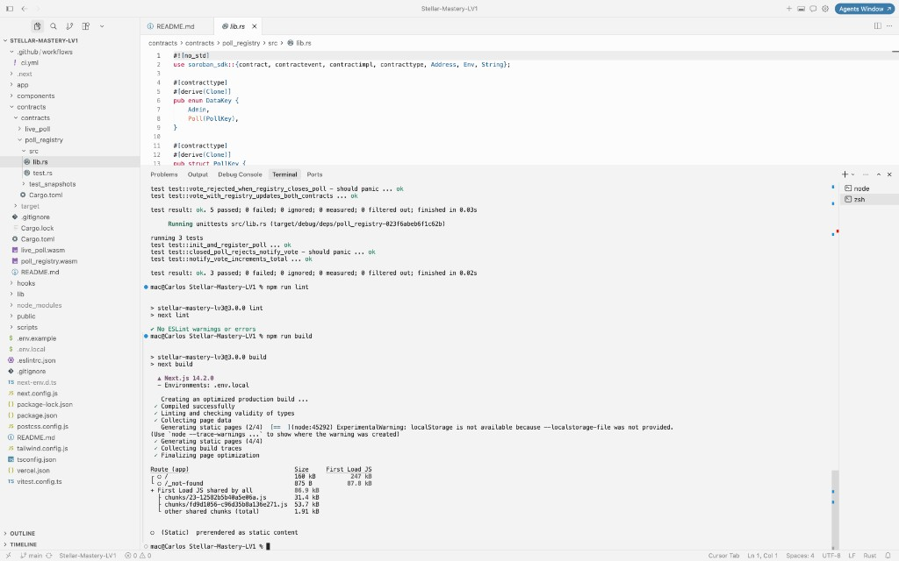

# Stellar Mastery — Level 1 White Belt + Level 2 Yellow Belt + Level 3 Orange Belt

A Stellar testnet dApp that grows from **Level 1 (White Belt)** payment basics through **Level 2 (Yellow Belt)** multi-wallet Soroban integration to **Level 3 (Orange Belt)** production-ready architecture with inter-contract communication, CI/CD, and comprehensive testing.

## Project description

### Level 1 — White Belt (Simple Payment dApp)
- Freighter / multi-wallet connection on testnet
- XLM balance display
- Send testnet XLM payments with success/failure feedback

### Level 2 — Yellow Belt (Live Poll dApp)
- **StellarWalletsKit** — Freighter, xBull, Albedo, LOBSTR, Hana, and more
- **Soroban smart contract** — deployed poll contract on testnet
- **Read/write contract data** — fetch yes/no totals, submit votes
- **Real-time events** — poll vote activity feed (RPC polling)
- **Transaction status** — pending / success / failed with explorer links
- **Error handling** — wallet not found, connection rejected, insufficient balance

### Level 3 — Orange Belt (Production dApp)
- **Inter-contract communication** — `live_poll` calls `poll_registry` on every vote
- **Advanced contract logic** — admin registry, poll open/close, cross-contract auth
- **Event streaming** — cursor-based incremental RPC polling with live status
- **CI/CD pipeline** — GitHub Actions for contract tests, frontend tests, lint, build
- **Deployment workflow** — automated two-contract deploy + wiring script
- **Mobile responsive UI** — viewport meta, flexible layouts, touch-friendly buttons
- **Error boundaries & retry** — production-grade error handling and loading states
- **Tests** — 8 contract tests + 7 frontend tests (15 total passing)
- **Production architecture** — env validation, security headers, contract API docs

**Project idea:** Live Poll with registry — admin-managed poll lifecycle and cross-contract vote validation.

## Live demo & video

| Resource | Link |
|----------|------|
| **Live demo (Vercel)** | [https://stellar-mastery-lv-1.vercel.app/](https://stellar-mastery-lv-1.vercel.app/) |
| **Demo video (Loom)** | [https://www.loom.com/share/6442a2386bd944d49308f174c2089d40](https://www.loom.com/share/6442a2386bd944d49308f174c2089d40) |

## Tech stack

| Technology | Purpose |
|------------|---------|
| Next.js 14 | React framework (App Router) |
| TypeScript | Type safety |
| Tailwind CSS | Responsive styling |
| Vitest | Frontend unit tests |
| `@creit.tech/stellar-wallets-kit` | Multi-wallet integration |
| `@stellar/stellar-sdk` | Horizon, Soroban RPC, contract calls, events |
| Soroban (Rust) | Two on-chain contracts with cross-contract calls |
| GitHub Actions | CI/CD pipeline |

## Architecture

```
┌──────────────┐     is_open()      ┌──────────────────┐
│  live_poll   │ ─────────────────► │  poll_registry   │
│  vote/emit   │     notify_vote()  │  admin/metadata  │
└──────┬───────┘                    └──────────────────┘
       │ VoteEvent
       ▼
┌──────────────┐     getEvents()     ┌──────────────────┐
│  Next.js UI  │ ◄───────────────── │  Soroban RPC     │
│  EventFeed   │     simulate()      │  (testnet)       │
└──────────────┘                    └──────────────────┘
```

## Deployed contracts (testnet) — Level 3

| Field | Value |
|-------|-------|
| Poll Contract | `CCKZ5NBIHONWNLHERVVT7LFD44ABLORC3JO6QYST7EZZP3WRBA7CBO5D` |
| Registry Contract | `CDKZUDRQFXPUOG5OQ62GUW74VOM6HGJVOQEQ7QGUE2FA6E36GTLXGIDA` |
| Network | Stellar Testnet |
| Poll Explorer | [View on Stellar Expert](https://stellar.expert/explorer/testnet/contract/CCKZ5NBIHONWNLHERVVT7LFD44ABLORC3JO6QYST7EZZP3WRBA7CBO5D) |
| Registry Explorer | [View on Stellar Expert](https://stellar.expert/explorer/testnet/contract/CDKZUDRQFXPUOG5OQ62GUW74VOM6HGJVOQEQ7QGUE2FA6E36GTLXGIDA) |
| Poll init tx | [a118d7cc7f209045ae0b92daf3ae8beec56c4db03742d4f57892e6a34b6d0262](https://stellar.expert/explorer/testnet/tx/a118d7cc7f209045ae0b92daf3ae8beec56c4db03742d4f57892e6a34b6d0262) |
| Poll configure tx | [97ae9364db46adc657c259e42126e567ce9c262be732d88447010c1599cd3f88](https://stellar.expert/explorer/testnet/tx/97ae9364db46adc657c259e42126e567ce9c262be732d88447010c1599cd3f88) |
| Registry init tx | [bdd4897b56dd402b5ff9c6d147adfe43d7290a3221a4f1c8bfd614bce2d12a19](https://stellar.expert/explorer/testnet/tx/bdd4897b56dd402b5ff9c6d147adfe43d7290a3221a4f1c8bfd614bce2d12a19) |
| Registry register_poll tx | [06eca184c0c2ecf1b029a6831a883608e281316364e634d84d67d1b5b5aad8c3](https://stellar.expert/explorer/testnet/tx/06eca184c0c2ecf1b029a6831a883608e281316364e634d84d67d1b5b5aad8c3) |
| Contract call — vote | [8505cb10f01856f6ccdedf0d632a36f724fd167f112a6779c3949937a67ddb81](https://stellar.expert/explorer/testnet/tx/8505cb10f01856f6ccdedf0d632a36f724fd167f112a6779c3949937a67ddb81) |

### Level 2 contracts (previous deployment)

| Field | Value |
|-------|-------|
| Poll Contract ID | `CAYIMSMU3DJRHUG5NUOJNO6BIBPQT7LMVPCO5JNOIGQRNPHBA7WWIIG7` |
| Poll Explorer | [View poll contract](https://stellar.expert/explorer/testnet/contract/CAYIMSMU3DJRHUG5NUOJNO6BIBPQT7LMVPCO5JNOIGQRNPHBA7WWIIG7) |
| Deploy tx | [8aa728926050c577fcececb8a54bb9d97935e1869d734db238670d053eeddaa8](https://stellar.expert/explorer/testnet/tx/8aa728926050c577fcececb8a54bb9d97935e1869d734db238670d053eeddaa8) |
| Contract call — vote (YES) | [2eb40475b12ad34ac8757d6d9e4c653937b608f70b457f52b7bf88ebbeb319d6](https://stellar.expert/explorer/testnet/tx/2eb40475b12ad34ac8757d6d9e4c653937b608f70b457f52b7bf88ebbeb319d6) |

## Prerequisites

- [Node.js 18+](https://nodejs.org/)
- [Rust](https://rustup.rs/) (for contract tests/build)
- [Stellar CLI](https://developers.stellar.org/docs/tools/cli) (for contract build/deploy)
- A Stellar wallet (Freighter, xBull, Albedo, LOBSTR, etc.)
- Wallet set to **Testnet**

## Setup instructions (run locally)

```bash
git clone https://github.com/robertocarlous/Stellar-Mastery-LV1.git
cd Stellar-Mastery-LV1

npm install

cp .env.example .env.local

npm run dev
```

Open [http://localhost:3000](http://localhost:3000).

### Fund your testnet wallet

1. Connect a wallet from the multi-wallet picker.
2. If balance is `0 XLM`, use **Fund with Friendbot** in the balance card.
3. Click **Refresh**.

### Vote on the live poll (Level 3)

1. Stay on the **Live Poll** tab.
2. Click **Vote Yes** or **Vote No**.
3. Approve the Soroban transaction in your wallet.
4. The poll contract calls the registry via cross-contract invoke.
5. Watch the real-time event feed and transaction status update.

## Deploy contracts (Level 3)

Deploys both `poll_registry` and `live_poll`, wires them together, and writes `.env.local`:

```bash
# Build both Soroban contracts
npm run contract:build

# Generate & fund a deployer key
stellar keys generate deployer --network testnet
curl "https://friendbot.stellar.org?addr=$(stellar keys address deployer)"

# Deploy registry + poll + init + configure + register
DEPLOYER_SECRET=$(stellar keys show deployer) npm run contract:deploy
```

The script writes `NEXT_PUBLIC_POLL_CONTRACT_ID` and `NEXT_PUBLIC_REGISTRY_CONTRACT_ID` to `.env.local`.

## Running tests

```bash
# Frontend tests (7 passing)
npm test

# Contract tests (8 passing)
npm run contract:test
```

## CI/CD pipeline

GitHub Actions workflow at `.github/workflows/ci.yml` runs on every push/PR:

| Job | Steps |
|-----|-------|
| **Soroban Contracts** | `cargo test` (8 tests) |
| **Frontend** | `npm ci` → `lint` → `npm test` (7 tests) → `npm run build` |

## Project structure

```
├── app/                         # Next.js App Router
├── components/
│   ├── WalletConnection.tsx     # Multi-wallet picker
│   ├── PollPanel.tsx            # Contract read/write + registry metadata
│   ├── EventFeed.tsx            # Real-time vote event stream
│   ├── ErrorBoundary.tsx        # Production error boundary
│   └── PaymentForm.tsx          # Level 1 XLM payments
├── contracts/
│   ├── contracts/live_poll/     # Soroban poll contract
│   └── contracts/poll_registry/ # Soroban registry contract
├── hooks/
│   ├── useWalletKit.ts          # Multi-wallet hook
│   └── useEventStream.ts        # Cursor-based event streaming
├── lib/
│   ├── contract/poll.ts         # Poll contract helpers
│   ├── contract/registry.ts     # Registry contract helpers
│   ├── contract/events.ts       # RPC event fetching
│   ├── env.ts                   # Env validation
│   └── poll-utils.ts            # Shared poll calculations
├── scripts/deploy-contract.mjs  # Two-contract deploy workflow
├── .github/workflows/ci.yml     # CI/CD pipeline
└── vitest.config.ts             # Frontend test config
```

## Screenshots (Level 1)

### Wallet connected state



### Balance displayed


### Successful testnet transaction



## Screenshots (Level 2)

### Wallet options available



### Wallet connected + Live Poll



### Successful poll vote + live event feed



## Screenshots (Level 3)

### Live demo — wallet connected, poll, and event feed

Deployed on Vercel with poll + registry contracts, live vote event stream, and transaction history.



### Frontend tests — 7 passing (Vitest)



### Contract tests — 8 passing (cargo test)

5 tests in `live_poll` + 3 tests in `poll_registry`.



### Lint & production build

ESLint passes with no warnings; Next.js production build completes successfully.



### Full CI pipeline (local verification)

Contract tests, lint, and production build — mirrors the GitHub Actions workflow in `.github/workflows/ci.yml`.



## Level 3 submission checklist

| Requirement | Status |
|-------------|--------|
| Public GitHub repository | ✅ |
| README with complete documentation | ✅ |
| Minimum 10+ meaningful commits | ✅ |
| Live demo link (Vercel/Netlify) | ✅ [stellar-mastery-lv-1.vercel.app](https://stellar-mastery-lv-1.vercel.app/) |
| Contract deployment address | ✅ |
| Transaction hash for contract interaction | ✅ |
| Screenshot: mobile responsive UI | ✅ |
| Screenshot: CI/CD pipeline running | ✅ (local CI verification — GitHub Actions blocked by account billing) |
| Screenshot: test output (3+ passing) | ✅ (8 contract + 7 frontend tests) |
| Demo video link (1–2 min) | ✅ [Loom walkthrough](https://www.loom.com/share/6442a2386bd944d49308f174c2089d40) |

### Level 3 feature checklist

- [x] Advanced smart contract development (registry + poll with admin roles)
- [x] Inter-contract communication (`live_poll` → `poll_registry`)
- [x] Event streaming & real-time updates (cursor-based polling hook)
- [x] CI/CD pipeline setup (GitHub Actions)
- [x] Smart contract deployment workflow (two-contract script)
- [x] Mobile responsive frontend development
- [x] Error handling & loading states (ErrorBoundary, retry, tx lifecycle)
- [x] Tests for contracts (8) and frontend (7)
- [x] Production-ready architecture (env validation, security headers, docs)

## Deployment (Vercel)

**Live app:** [https://stellar-mastery-lv-1.vercel.app/](https://stellar-mastery-lv-1.vercel.app/)

```bash
npm run build
```

Set environment variables in Vercel:
```
NEXT_PUBLIC_POLL_CONTRACT_ID=CCKZ5NBIHONWNLHERVVT7LFD44ABLORC3JO6QYST7EZZP3WRBA7CBO5D
NEXT_PUBLIC_REGISTRY_CONTRACT_ID=CDKZUDRQFXPUOG5OQ62GUW74VOM6HGJVOQEQ7QGUE2FA6E36GTLXGIDA
```

## Troubleshooting

| Issue | Fix |
|-------|-----|
| No wallets shown | Install Freighter or another supported extension |
| Connection rejected | Approve the connection prompt in your wallet |
| Insufficient balance | Fund with Friendbot — contract txs need ~1+ XLM |
| Contract not configured | Set `NEXT_PUBLIC_POLL_CONTRACT_ID` in `.env.local` |
| Registry not configured | Redeploy with `npm run contract:deploy` |
| Vote fails — poll closed | Registry admin closed the poll |
| Vote fails | Ensure wallet is on Testnet and has XLM for fees |
| CI fails on contracts | Ensure Rust toolchain is available (`cargo test` locally) |

## License

MIT
