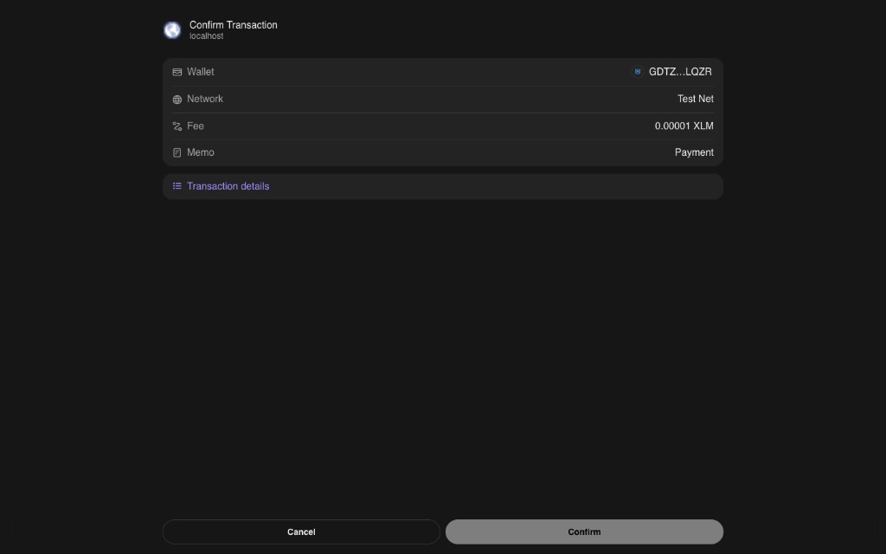

# Stellar Mastery — Level 1 White Belt

A simple Stellar testnet payment dApp built for **Level 1 – White Belt**. Connect your Freighter wallet, view your XLM balance, and send testnet payments with clear success/failure feedback.

## Project description

This app demonstrates the core fundamentals of Stellar development:

- **Wallet setup** — Freighter wallet on Stellar Testnet
- **Wallet connection** — Connect and disconnect Freighter
- **Balance handling** — Fetch and display the connected wallet's XLM balance
- **Transaction flow** — Build, sign, and submit XLM payments on testnet with transaction hash feedback

**Project idea:** Simple Payment dApp — send XLM to any address with amount input.

## Tech stack

| Technology | Purpose |
|------------|---------|
| Next.js 14 | React framework |
| TypeScript | Type safety |
| Tailwind CSS | Styling |
| `@stellar/freighter-api` | Freighter wallet integration |
| `@stellar/stellar-sdk` | Horizon API, balance fetch, transaction build/submit |

## Prerequisites

- [Node.js 18+](https://nodejs.org/)
- [Freighter wallet](https://freighter.app) browser extension
- Freighter set to **Testnet** (Settings → Network → Testnet)

## Setup instructions (run locally)

```bash
# Clone the repository
git clone https://github.com/robertocarlous/Stellar-Mastery-LV1.git
cd Stellar-Mastery-LV1

# Install dependencies
npm install

# Start the development server
npm run dev
```

Open [http://localhost:3000](http://localhost:3000) in your browser.

### Fund your testnet wallet

1. Connect Freighter in the app.
2. If your balance is `0 XLM`, click **Fund with Friendbot** in the balance card.
3. Click **Refresh** to update your balance.

### Send a test payment

1. Enter a valid Stellar public key (`G...`).
2. Enter an amount in XLM.
3. Click **Send XLM** and approve the transaction in Freighter.
4. View the success message and transaction hash, or an error if the payment fails.

## Project structure

```
├── app/
│   ├── globals.css
│   ├── layout.tsx
│   └── page.tsx
├── components/
│   ├── BalanceDisplay.tsx
│   ├── PaymentForm.tsx
│   ├── TransactionResult.tsx
│   └── WalletConnection.tsx
├── hooks/
│   └── useWallet.ts
├── lib/
│   ├── freighter.ts    # Freighter connect, sign, network check
│   └── stellar.ts      # Horizon balance, payment build/submit
└── public/screenshots/ # Add submission screenshots here
```

## Screenshots

### Wallet connected state

Freighter connected on Stellar Testnet with the wallet public key displayed.


### Balance displayed

XLM balance fetched from Horizon testnet and shown in the UI.


### Freighter transaction confirmation

Payment approved in Freighter on Testnet (fee: 0.00001 XLM).



### Successful testnet transaction

Payment sent with success feedback and transaction hash shown to the user.


### Sample testnet transaction

| Field | Value |
|-------|-------|
| Network | Stellar Testnet |
| Amount | 10 XLM |
| Transaction hash | `38f8edc4020cbe20b7983dfff746a3caf9a843960642b24d912e8340372d78db` |
| Explorer | [View on Stellar Expert](https://stellar.expert/explorer/testnet/tx/38f8edc4020cbe20b7983dfff746a3caf9a843960642b24d912e8340372d78db) |

## White Belt checklist

- [x] Freighter wallet + Stellar Testnet
- [x] Wallet connect functionality
- [x] Wallet disconnect functionality
- [x] Fetch connected wallet XLM balance
- [x] Display balance clearly in the UI
- [x] Send XLM transaction on testnet
- [x] Show success/failure state
- [x] Show transaction hash / confirmation message
- [ ] Public GitHub repository
- [ ] Deployed application (optional but recommended)
- [x] README screenshots added

## Deployment

This app is a static-friendly Next.js client app. Deploy to [Vercel](https://vercel.com), [Netlify](https://netlify.com), or any platform that supports Next.js:

```bash
npm run build
npm start
```

## Troubleshooting

| Issue | Fix |
|-------|-----|
| Freighter not detected | Install the extension and refresh the page |
| Wrong network error | Switch Freighter to Testnet |
| Balance is 0 | Use Friendbot to fund your testnet account |
| Transaction fails | Ensure enough XLM for amount + fees; verify recipient address |

## License

MIT
